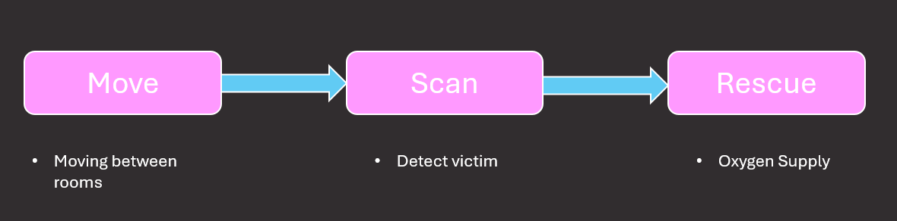
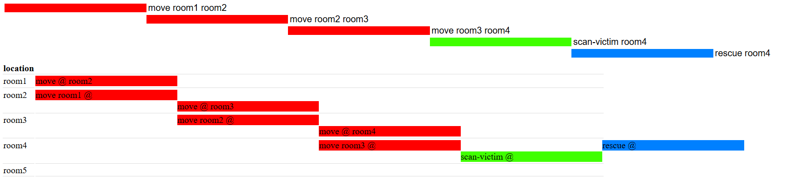
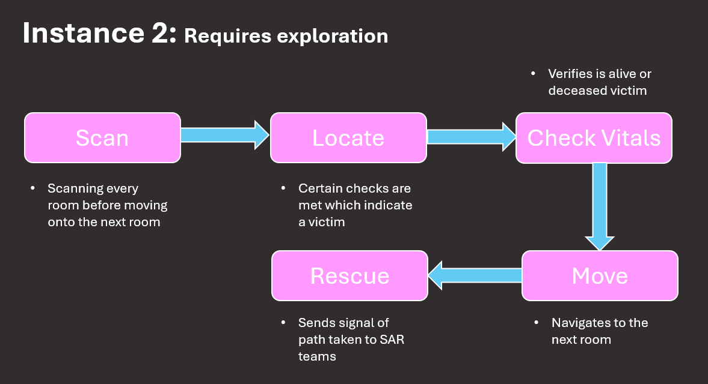
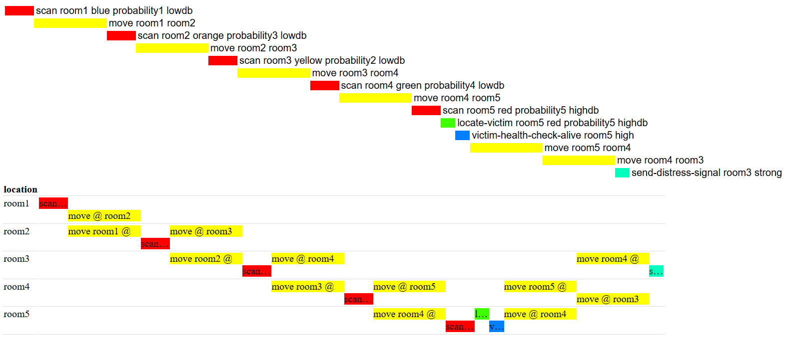
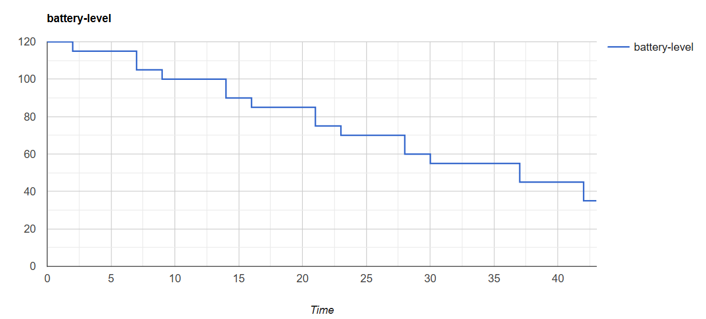
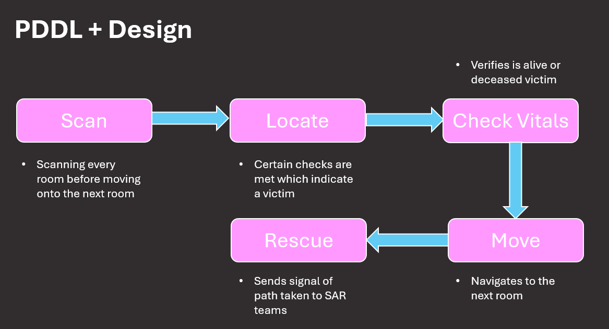
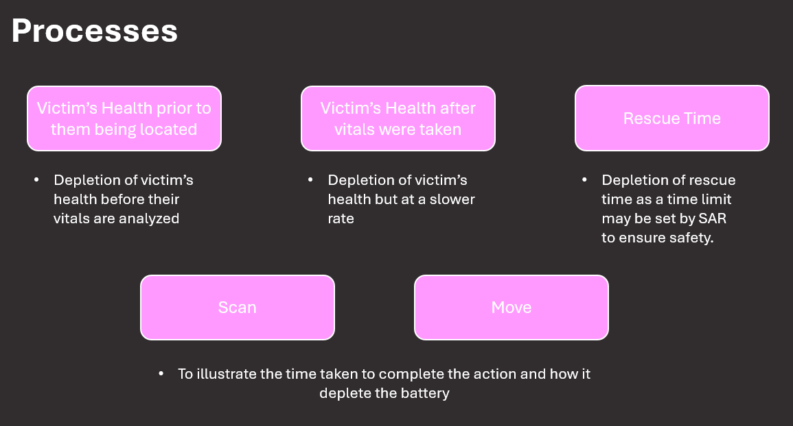
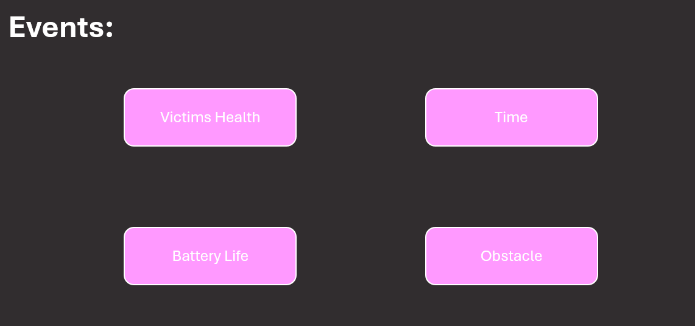
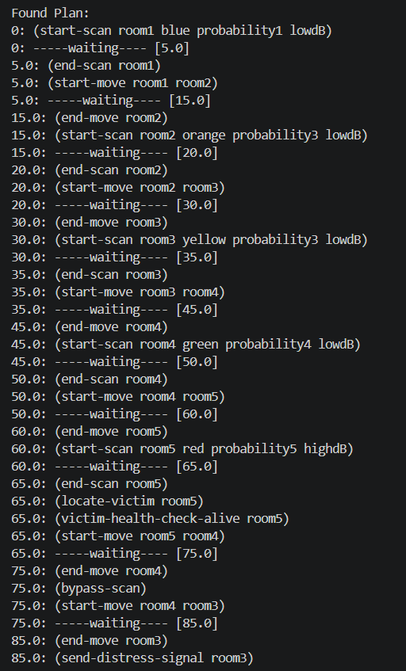

# Search and Rescue– Unknown Victim Location Scenario

The design of the PDDL/+ model primarily focuses on the logic used for search and rescue robots. The comprehensive design adheres to an explore-detect-rescue architecture. Exploration relies on a topological map; detection is demonstrated using sensory technologies, and rescue operations transmit the information collected by the robot's exploration to search and rescue (SAR) teams. The design choices for each question enhance the applicability of PDDL/+ and the constraints associated with PDDL/+. 

## Design Logic:
The logical design of this PDDL/+ is derived from the technology incorporated into robots for search and rescue (SAR) and the protocols that SAR teams must adhere to during natural or man-made disasters resulting in collapsed structures. This system mimics the exploration and assessment of victims with chemical sensors, thermal imaging, camera detection, and microphones. Chemical sensors and thermal imaging are mostly employed to assess victims' vital signs using specific methodologies that will be elaborated further. The camera detection, thermal imaging, and microphones facilitate the robot's autonomous navigation, with microphones aiding in locating the victim, while the camera and thermal imaging verify the presence of the victim. 

Monitoring battery life, victims' health, and rescue duration correlates with the success rate of the rescue operation. If the battery life is insufficient for the duration of the rescue, it is a significant waste of time for SAR teams. In the event of a building collapse or approaching natural disaster, it is imperative to monitor rescue times to guarantee the safety of SAR personnel and victims. If SAR anticipates the victim's condition will worsen after evaluation, they must regrettably redirect their resources to maintain search efficiency. 

The rescue operations are designed to signal to SAR teams the path taken by the robot. This assists SAR personnel in mapping the victim's location within the structure's layout and, therefore, identifying the most efficient entry route to minimise additional structural damage. 

## Domain Characteristics 
1. Robot: single mobile robot
2. Environment: known topology, unknown victim location
3. Tasks: exploration, detection, rescue
4. Constraints: information acquisition


## Q1- Basic PDDL Model

1. Instance with known location
    - Since the location of the victim is known
    - **No explicit exploration** is required for each room. 
    - Instead, the robot simply navigates to the known room. 
    - Completes an explicit **detection** in the room where the victim is known. 
    - Its **rescue** operation involves supplying oxygen to the victim.

Therefore, the *problem file* is limited to the connected rooms and the anticipated presence of a victim in the dedicated room. The *domain* file involves the robot navigating from room to room until it reaches the room where the victim is located, at which point it completes the scan and provides oxygen. The scanning procedure ensures the presence of the victim. The victim is verified with a high decibel level, a red thermal reading, and a high visual probability.

# Architectural Design of Instance 1:



# Plan Executed for Instance 1:




2. Instance requiring exploration
    - Since the location is **not known**, the robot has to go into each room and perform the respective sensing actions before it can move on to the next room. 
    - The sensing actions are the **technology** currently used by SAR teams.

Therefore, the *problem file* consists of room connections, the decibel readings, thermal imaging readings, the probability of human detection using the cameras, chemical readings, and battery health. 

While the *domain* focuses on scanning every room before moving on to the next, it also involves locating the victim and performing the rescue action. A high decibel level, a red thermal reading, and a high visual probability indicate the presence of a victim. The assessment of the victim's vitals indicates a high CO₂ level for living victims and a high ammonia level for deceased victims. 

Rescue operations remain as previously stated, where a signal is sent to SAR teams for the mapping of the victim's location within the structural layout for an efficient extraction strategy. 

# Architectural Design of Instance 2:



# Plan Executed for Instance 2:





## Q2- PDDL+ Model 

3. Victim Health Degradtion
4. Discovery or failure conditions
5. Exploration delays affecting rescue success


## Q2- PDDL+ Model 

3. Victim Health Degradtion
4. Discovery or failure conditions
5. Exploration delays affecting rescue success

Therefore, the *problem file* consists of room connections, the decibel readings, thermal imaging readings, the probability of human detection using the cameras, chemical readings, and battery health. 

While the *domain* focuses on scanning every room before moving on to the next, it also involves locating the victim and performing the rescue action. A high decibel level, a red thermal reading, and a high visual probability indicate the presence of a victim. The assessment of the victim's vitals indicates a high CO₂ level for living victims and a high ammonia level for deceased victims.  

## Success Analysis:

Scenario 1:
```bash
Battery life = 110
victim-health = 110
rescue = 100
```

- It successfully locates the victim and reports back. 

Scenario 2:
```bash
Battery Life = 80
victim-health = 100
rescue = 100
```

- Battery runs out before all-data-sent can be achieved.
- Failure to produce a plan ✅

Scenario 3:
- An obstacle is placed in the second room. 
- The plan fails because it cannot reach the victim to assess their vitals, which triggers the all-data-sent protocol.
- Failure to produce a plan ✅

Scenario 4:
- Changing victims' health 
- Failure to produce a plan ✅

Scenario 5:
- Deceased victims after their vitals have been taken
- Failure to produce a plan ✅


# Architectural Design PDDL+:





# Plan Executed for PDDL+:




# Limitations:
A significant limitation of PDDL/PDDL+ is that it relies on spatial abstraction rather than geometric representation of the world. This is why the problem files denote the environment with defined world variables; however, they do not account for geometric conditions. For instance, PDDL/+ cannot model the robot's exact location within the world. This limitation is better illustrated by the scenario in which, after locating a victim, the robot must move closer to analyse the victim's vitals; this allows the chemical sensor system to determine whether the victim is alive or dead. It also ignores the room's size and the robot's required movements to search it.

PDDL/+ functions on closed-world assumptions and operates deterministically. The given world scenario is assumed to be optimal, requiring the fulfillment of all stated activities to accomplish the desired goal of "sending all data." Consequently, if the sensor fails to identify a victim through camera detection due to insufficient visibility, false negatives, or the absence of sound from the victim, the planner cannot handle these uncertainties. Thus, requiring a more heavily modified framework. This modification requires a higher computational complexity, which can cause the planner to malfunction and enter into an infinite evaluation cycle.

A further limitation of PDDL/+ is the rigidity of goal states. An example is if a "fallback" goal were established. This would involve transmitting the data even if the victim's health deteriorates after monitoring their vitals. This scenario creates a disjunctive goal, and the planner would have the choice of which one to achieve. When tested, it revealed that the heuristic planner chooses the path with the least resistance, which is to refrain from moving the robot to allow the victim's health to deteriorate naturally, thereby easily achieving the second goal.

This behavior completely disobeys the logical sequence of the SAR tactic. The ideal logical sequence consists of first attempting to send the goal while the victim is still alive, then acknowledging that the first goal is unattainable, and finally resorting to the second goal. The second goal would still explicitly explore, detect, and rescue. 

To prevent this entirely, the use of *abort-mission* was implemented as an effect for each of the events presented in the architectural design of PDDL+. Therefore, the processes shown in the architectural design of PDDL+ could not continue if the *abort-mission* became true. 

A difference highlighted between PDDL and PDDL+ is that, for the *second instance*, all actions had to be converted into durative actions. If not, the system would duplicate the depletion of the battery; the issue was due to a time conflict created by the planner. For example, the battery must be above 20 at the start of any action. However, since durative actions are used, the effect of depleting the battery does not affect the commencement of the action itself. This is the difference between discrete intervals and continuous state evaluation. As demonstrated, the issue is prevented in PDDL+, where it was able to avoid this scenario due to PDDL+ capabilities.


# Execution:

### To execute the first instance of basic PDDL with the known location, follow the instructions below:
1. The domain file is **Q1_domain**
2. The problem file is **Q1_problem**
3. Right-click on the problem file and select `PDDL: Run the planner and display the plan`
4. Then select the `BFWS FF-parser version dual-bfws-ffparser` planner


### To execute the second instance of basic PDDL where exploration is required, follow the instructions below:
1. The domain file is **Q2_domain**
2. The problem file is **Q2_problem**
3. Right-click on the problem file and select `PDDL: Run the planner and display the plan`
4. Then select the `OPTIC: Optimising Preferences and Time-Dependent Costs optic` planner. This planner works better with durative actions.

### To execute the PDDL+, follow the instructions below:
1. The domain file is **Q3_domain**
2. The problem file is **Q3_problem**
3. A local ENHSP planner should be installed. Thank you to Enrico Scala and other contributors for publishing the ENHSP planner. Please refer to his GitHub for assistance: https://gitlab.com/enricos83/ENHSP-Public/-/tree/master?ref_type=heads
4. As instructed from the ENHSP-Pulic repository, the following should be typed in your terminal:
```bash
java -jar enhsp-dist/enhsp.jar -o <domain_file> -f <problem_file>
```